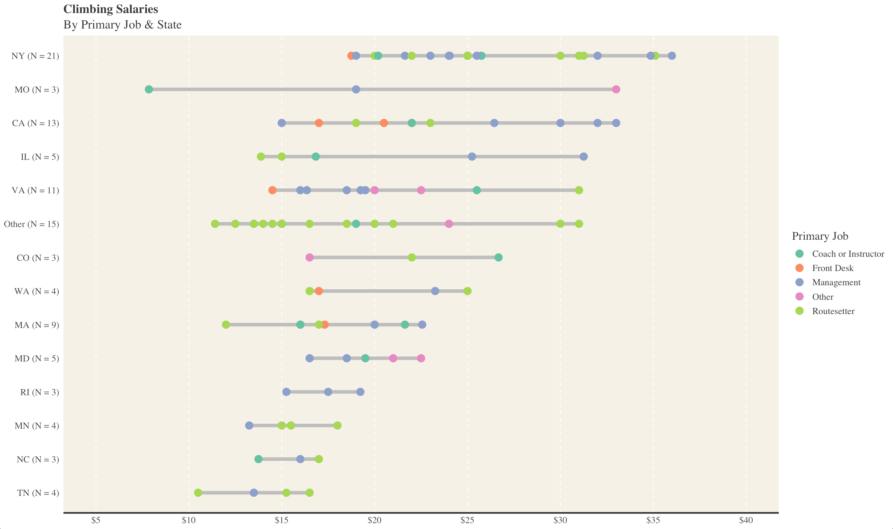

# Climbing-Wage-Viz

Quick lollipop visualization of climbing industry salaries/wage from Reddit

Data was pulled from an anonymous form posted on Reddit in July of 2020 ([link](https://docs.google.com/spreadsheets/d/17JfBLnZmoVY8E-kHjT75N_SnrrVaSXffThBmhVUUstI/edit#gid=295722857)). There were a total of 272 responses, which were cleaned and filtered to generate the data set used for this visualization. The resulting data set includes 107 entries where the respondent was a full-time employee located in the US. Both data sets are available in the repository. 

 

 <figure>
   Figure 1. Sample screenshot</figcaption>
</figure>

 
